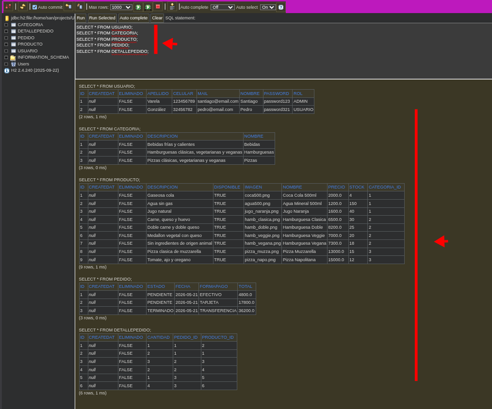
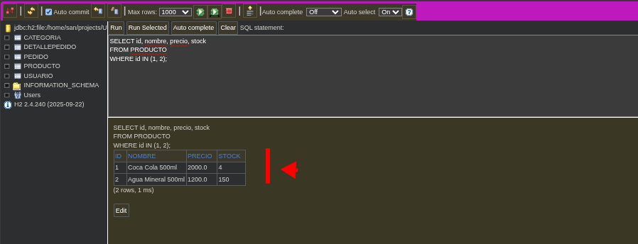
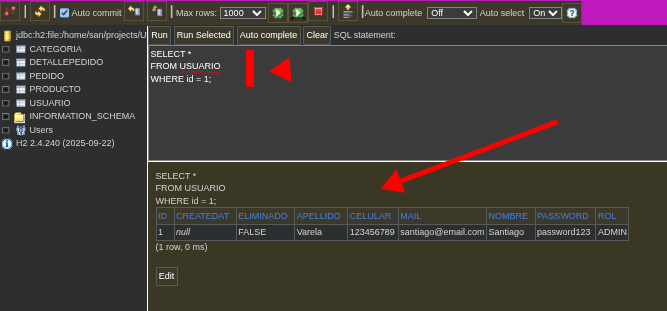
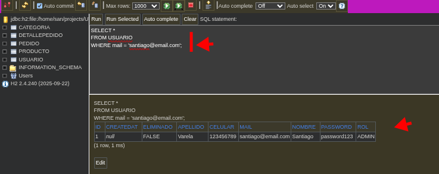
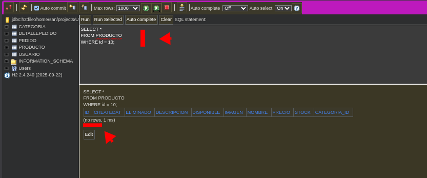
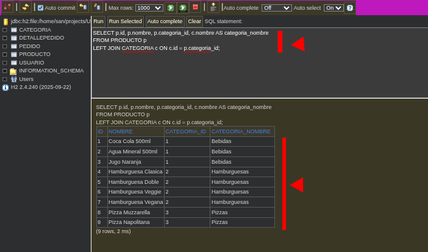
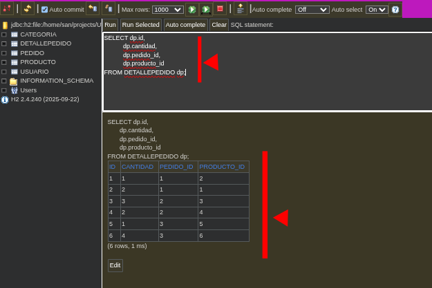

# Segundo Examen Parcial - Java Persistence API (JPA) - Programación III - UTN TUPaD

Cree un archivo Markdown para la resolución de cada una de las consignas (principalmente para guiarme yo y poder revisar los cambios unidad por unidad en el proyecto.). Pueden verlo aquí: [docs/resolucion.md](docs/resolucion.md)

✨ Estudiante

- Nombre: Varela, Santiago Octavio
- Comisión: M25 C3-13
- Email institucional: santiago.varela@tupad.utn.edu.ar

Repositorio donde podrán encontrar mis trabajos de Programación III: https://github.com/santiagovOK/UTN-TUPaD-P3

---

<details>
<summary>Validación visual con H2</summary>

### Consigna 2 - Persistencia inicial

**Consulta general para todas las entidades**
```sql
SELECT * FROM USUARIO;
SELECT * FROM CATEGORIA;
SELECT * FROM PRODUCTO;
SELECT * FROM PEDIDO;
SELECT * FROM DETALLEPEDIDO;
```



### Consigna 3 - Actualización de productos

```sql
SELECT id, nombre, precio, stock
FROM PRODUCTO
WHERE id IN (1, 2);
```



### Consigna 4 - Búsqueda de usuario por id

```sql
SELECT *
FROM USUARIO
WHERE id = 1;
```



### Consigna 5 - Búsqueda de usuario por mail

```sql
SELECT *
FROM USUARIO
WHERE mail = 'santiago@email.com';
```



### Consigna 6 - Borrado de un producto

```sql
SELECT *
FROM PRODUCTO
WHERE id = 10;
```

> Si la consigna de borrado se ejecutó correctamente, esa consulta no debería devolver filas.



### Validaciones de relación

**Productos con su categoría**
```sql
SELECT p.id, p.nombre, p.categoria_id, c.nombre AS categoria_nombre
FROM PRODUCTO p
LEFT JOIN CATEGORIA c ON c.id = p.categoria_id;
```



**Detalles con pedido y producto**
```sql
SELECT dp.id,
	   dp.cantidad,
	   dp.pedido_id,
	   dp.producto_id
FROM DETALLEPEDIDO dp;
```



</details>